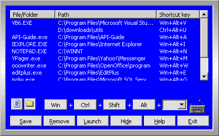



## Program Launcher

### Description

Program Launcher is a simple utility to launch files/folders by pressing a combination of keys, irrespective of whichever application is active. This utility is similar to the one used by multimedia keyboards. All multimedia keyboards makes use of a program which is running in the background. The only difference being that the multimedia keyboards have special keys like volume control which does not need that program to be active.
 
### More Info
 

             |
---                |---
**Submitted On**   |2004-06-19 14:55:30
**By**             |[Meyyappan](https://github.com/Planet-Source-Code/PSCIndex/blob/master/ByAuthor/meyyappan.md)
**Level**          |Intermediate
**User Rating**    |5.0 (15 globes from 3 users)
**Compatibility**  |VB 6\.0
**Category**       |[Windows API Call/ Explanation](https://github.com/Planet-Source-Code/PSCIndex/blob/master/ByCategory/windows-api-call-explanation__1-39.md)
**World**          |[Visual Basic](https://github.com/Planet-Source-Code/PSCIndex/blob/master/ByWorld/visual-basic.md)
**Archive File**   |[Program\_La1759096192004\.zip](https://github.com/Planet-Source-Code/meyyappan-program-launcher__1-54466/archive/master.zip)

